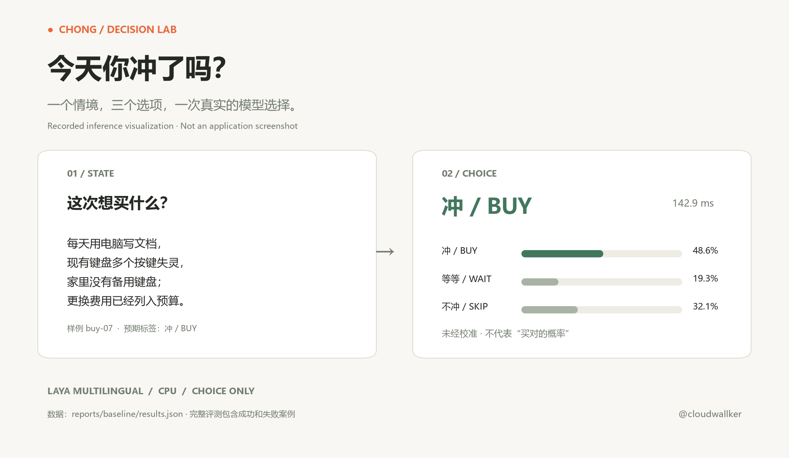
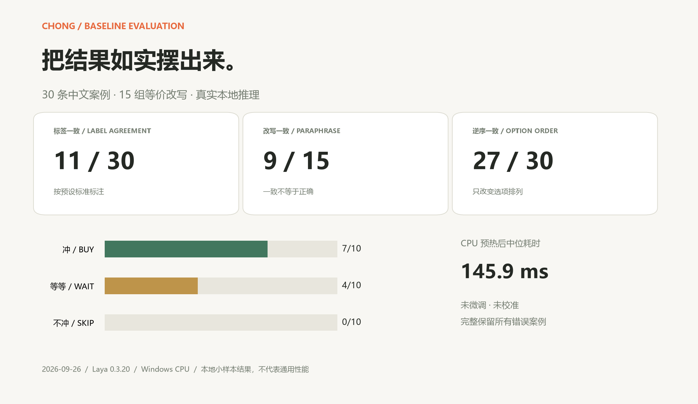

# 今天你冲了吗? · Should I Buy It?

**English summary:** A local shopping-decision experiment using the Laya multilingual model. Describe a purchase and inspect its **buy / wait / skip** choice, uncalibrated probabilities, inference time, request, and raw response.

**中文简介：** 基于 Laya 多语言模型的本地购物决策实验。输入购物情况，查看「冲 / 等等 / 不冲」的模型选择、未经校准的概率及原始请求与返回。

[中文 README](README.md) · [Full evaluation report (Chinese)](reports/baseline/README.md)

This is an experiment for inspecting model behavior, not a reliable shopping adviser. The displayed probabilities express the model's relative preference among three options; they are **not** the probability that its advice is correct.



This visualizes the real `buy-07` inference record; **it is not an application screenshot**. The exact request and response are available in the [machine-readable report](reports/baseline/results.json).

## Run locally

Use Python 3.11 and [uv](https://docs.astral.sh/uv/getting-started/installation/). The following setup targets Windows PowerShell and CPU. The first run downloads public model weights from Hugging Face (about 650 MB of cache space); no API key is needed.

```powershell
uv venv --python 3.11 .venv
uv pip install --python .venv/Scripts/python.exe 'torch==2.14.0+cpu' --index-url https://download.pytorch.org/whl/cpu
uv pip install --python .venv/Scripts/python.exe -r requirements.txt
.venv/Scripts/python.exe -m streamlit run app.py
```

Open the local address shown by Streamlit (usually <http://localhost:8501>). Choose a preset or describe a purchase, then click **冲不冲** (“Buy it?”). The model is reused within the current page session. Changing the input or preset clears the previous result. Initial loading takes longer than subsequent inferences.

On macOS/Linux, use `.venv/bin/python` instead of `.venv/Scripts/python.exe`. For a basic setup, the application requirements will install a compatible PyTorch build; consult the [PyTorch installation guide](https://pytorch.org/get-started/locally/) if you need a specific CPU or accelerator build.

```bash
uv venv --python 3.11 .venv
uv pip install --python .venv/bin/python -r requirements.txt
.venv/bin/python -m streamlit run app.py
```

`requirements.txt` pins the application packages (`laya==0.3.20`, `streamlit==1.64.0`). `requirements-lock.txt` is a full snapshot of the evaluated Windows CPU environment, not a cross-platform lock. Once the weights are cached, setting `HF_HUB_OFFLINE=1` enables offline use. The default model cache is `.cache/huggingface` within the project unless `HF_HOME` is already set.

## How the choice works

The project calls the `choice` interface in the [official Laya SDK](https://github.com/NandhaKishorM/laya) with the [`convaiinnovations/laya-multilingual` checkpoint](https://huggingface.co/convaiinnovations/laya-multilingual), described on its model card as about 322M parameters. The purchase description and these criteria go to the model together:

| Key | UI label | Criterion sent to the model |
| --- | --- | --- |
| `buy` | 冲 | Clear purpose, enough budget, current items do not meet the need |
| `skip` | 不冲 | Budget pressure; or an adequate substitute and motivation mainly from a promotion |
| `wait` | 等等 | Other situations, including missing key information |

Budget pressure has priority in the written criteria, but the application does not override the model's choice with fixed rules. The [model card's limits](https://huggingface.co/convaiinnovations/laya-multilingual#limits) warn that the multilingual weights are uncalibrated and can be overconfident. This project does not fine-tune or calibrate the model, and it does not generate reasons for decisions.

Input is limited to **500 characters**. Before inference, the application also checks the length with the actual tokenizer to avoid silent truncation. Blank, overlong, or token-budget-exceeding input raises `InputError`; load failures raise `ModelLoadError`; inference failures or invalid responses raise `InferenceError`.

Python usage:

```python
from chong.decision import decide

result = decide("My keyboard has failing keys, I need it daily, have no spare, and budgeted for a replacement.")
print(result.choice)          # Actual model choice: buy / wait / skip
print(result.probabilities)   # Uncalibrated probabilities
print(result.elapsed_ms)      # Tokenization and inference; excludes model loading
print(result.to_dict())       # Includes model, request, and raw_response
```

`decide(context, *, engine=None, option_order=None)` accepts a reusable `DecisionEngine`. `option_order` supports tests of sensitivity to candidate order.

## Baseline evaluation

On 2026-09-26, after one warm-up on Windows, Python 3.11.14, and CPU, the model ran **30 baseline requests plus 30 reversed-option requests**. The 30 Chinese texts are paraphrases of **15 fictional shopping situations**. Expected labels were written before the run according to the [annotation rules](data/README.md).



| Measure | Result |
| --- | ---: |
| Agreement with expected labels | **11/30 (36.7%)** |
| Hits for expected buy / wait / skip | **7/10 · 4/10 · 0/10** |
| Same choice across paraphrases | 9/15 pairs (60.0%) |
| Same choice when options are reversed | 27/30 requests (90.0%) |
| Median warmed-up baseline inference time | 145.9 ms |
| Baseline and reversed-order inference errors | 0 |

The model missed every expected `skip` case in this set; even a description of budget pressure can lead to `buy`. Paraphrase and order consistency measure whether the choice stays the same, **not whether it is correct**. These small, hand-authored cases do not establish general shopping advice quality. Inference time can change with hardware, runtime, and model revision.

See the [full report and per-case outcomes](reports/baseline/README.md), [machine-readable report with exact requests and raw responses](reports/baseline/results.json), and [30 cases](data/cases.jsonl). The recorded checkpoint revision is `e4e9ddf21a7b1903b7acffd8814ad4307bf63a67`.

To rerun the evaluation on Windows, use the same environment as above. Output defaults to `reports/latest` and does not replace the included baseline:

```powershell
.venv/Scripts/python.exe -m chong.evaluation
.venv/Scripts/python.exe -m chong.evaluation --output reports/local-my-run
```

All baseline requests count in the expected-label agreement denominator. Paraphrase and order consistency include only comparable cases. Failed model loading produces a `failed` report rather than an invented accuracy figure.

## Tests and layout

```powershell
uv pip install --python .venv/Scripts/python.exe -r requirements-dev.txt
.venv/Scripts/python.exe -m pytest -q
```

The automated tests use SDK substitutes; the included baseline report used the actual model weights.

After installing the development dependencies, regenerate both images from the included baseline records:

```powershell
.venv/Scripts/python.exe scripts/render_examples.py
```

```text
app.py                  Streamlit interface
chong/decision.py        Laya inference and input validation
chong/evaluation.py      Case evaluation and report export
chong/runtime.py         Local cache setup
data/                   Cases and annotation notes
reports/baseline/        Evaluation report and per-case responses
docs/images/            Inference-record and evaluation images
scripts/                Image generation from baseline records
tests/                  Automated tests
```

The app keeps input and results only in the current session and does not save shopping history. Initial weight download contacts Hugging Face. [Laya code](https://github.com/NandhaKishorM/laya) and its [model](https://huggingface.co/convaiinnovations/laya-multilingual) use Apache-2.0; this repository does not contain model weights. The [jevlike](https://github.com/vinnylarouge/jevlike) context-plus-candidates experiment inspired the interface approach.

Maintainer: [@cloudwallker](https://github.com/cloudwallker)
